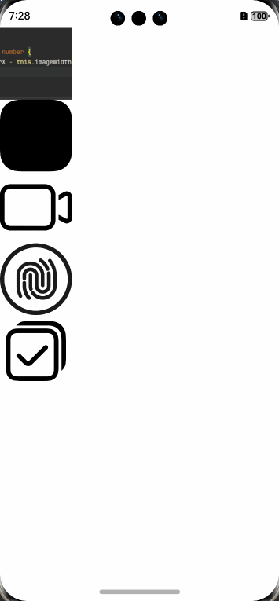

# image-preview

须知：
- 当配置下拉手势时可能会出现现实异常的问题

## 简介

image-preview 提供图片预览组件，支持缩放和平移，提供一些自定义属性和事件监听。

## 下载安装

`ohpm install @rv/image-preview`

## 权限

无需权限，若使用网络资源图片，需要互联网访问权限。

## 属性列表

| 属性名          | 类型                       | 必须 | 默认值  | 描述          |
|--------------|--------------------------|----|------|-------------|
| `controller` | `ImagePreviewController` | 是  | null | 配置选项，集体如下介绍 |

## 使用
```typescript
ImagePreview({ controller: this.controller })
```

## ImagePreviewController

### 构造函数

```ts
constructor(images?: ImageType[] = [])
其中:
type ImageType = PixelMap | ResourceStr | DrawableDescriptor
```

### 接口说明

> 接口均支持链式调用

### ImagePreviewController 类

#### 属性

- **imagesData**: `ImageDataSource` - 图片数据源。
- **listScroller**: `ListScroller` - 列表滚动器。
- **bgColor**: `ResourceColor` - 背景颜色，默认为透明（使用状态管理）。
- **cachedCount**: `number` - 缓存数量，默认为3（使用状态管理）。
- **currentPage**: `number` - 当前页码，默认为0（外部修改无效）。
- **currentScrollPage**: `number` - 滚动过程中的页面索引（外部修改无效）。
- **initialIndex**: `number` - 初始展示的页面索引。
- **maxScale**: `number` - 最大缩放比例，默认为5。
- **onLongPress**: `ImgLongPressCallback` - 长按事件回调。
- **onClick**: `ImgClickCallback` - 单击事件回调。
- **onPullDown**: `ImgPullDownCallback` - 下拉事件回调。
- **onFlip**: `ImgFlipCallback` - 翻页完成事件回调。
- **onWillFlip**: `ImgFlipCallback` - 即将翻页事件回调。
- **transitionIdGenerator**: `TransitionIdGeneratorCallback` - 共享元素专场id生成策略回调。
- **isAutoResize**: `boolean` - 设置图片解码过程中是否对图源自动缩放（使用状态管理）。

#### 方法

- **setImage(images: ImageType[])**: 设置图片数据。
- **addImage(image: ImageType)**: 添加图片。
- **removeImage(index: number)**: 移除指定索引的图片。
- **showNext()**: 显示下一页。
- **showPrevious()**: 显示上一页。
- **setParser(callback: ImgParserCallBack)**: 设置图片解析回调。
- **setBgColor(color: ResourceColor)**: 设置背景颜色。
- **setInitialIndex(index: number)**: 设置初始展示的页面索引。
- **setCachedCount(count: number)**: 设置缓存数量。
- **setMaxScale(maxScale: number)**: 设置最大缩放比例。
- **setOnLongPress(callback: ImgLongPressCallback)**: 设置长按事件回调。
- **setOnClick(callback: ImgClickCallback)**: 设置单击事件回调。
- **setOnPullDown(callback: ImgPullDownCallback)**: 设置下拉事件回调。
- **setOnFlip(callback: ImgFlipCallback)**: 设置翻页完成事件的回调函数。当用户翻页操作完成后，此回调函数将被调用。
- **setOnWillFlip(callback: ImgFlipCallback)**: 设置即将翻页事件的回调函数。当用户开始翻页操作，且在翻页完成之前，此回调函数会被持续调用。这可以用于预测即将发生的翻页动作，或者用于实现一些动态效果。
- **setTransitionIdGenerator(callback: TransitionIdGeneratorCallback)**: 设置共享元素专场id生成策略回调。
- **setAutoResize(isAutoResize: boolean)**: 设置图片解码过程中是否对图源自动缩放。
- **setIndicatorType(indicatorType: IndicatorType)**: 设置指示器类型。
- **setIndicatorStyle(indicatorStyle: DigitalIndicatorStyle | DotIndicatorStyle)**: 设置指示器样式。

---

### 类型定义

#### ImageType

图片类型，可以是 `PixelMap`、`ResourceStr` 或 `DrawableDescriptor`。

#### ImgLongPressCallback

长按事件回调类型，参数为 `(event: GestureEvent, index: number)`。

#### ImgClickCallback

单击事件回调类型，参数为 `(event: GestureEvent, index: number)`。

#### ImgPullDownCallback

下拉事件回调类型，参数为 `(event: GestureEvent, index: number)`。

#### ImgFlipCallback

翻页事件回调类型，参数为 `(prePage: number, nextPage: number)`。

#### TransitionIdGeneratorCallback

共享元素专场id生成策略回调类型，参数为 `(image: ImageType, index: number)`。

#### ImgParserCallBack

图片自定义解析回调类型，参数为 `(image: ImageType, index: number)`，返回 `ImageType`。

#### IndicatorType

指示器类型，可以是 `DOT`、`DIGITAL` 或 `NONE`。

#### DigitalIndicatorStyle

数字指示器样式，包含以下属性：
- **text**: `ResourceStr` - 文本内容。
- **fontSize**: `Length` - 字体大小。
- **fontColor**: `ResourceColor` - 字体颜色。
- **fontWeight**: `FontWeight` - 字体粗细。
- **fontStyle**: `FontStyle` - 字体样式。

#### DotIndicatorStyle

圆点指示器样式，包含以下属性：
- **indicatorWidth**: `Length` - 指示器宽度。
- **dotWidth**: `Length` - 圆点宽度。
- **dotHeight**: `Length` - 圆点高度。
- **dotSpace**: `number | string` - 圆点间距。
- **dotRadius**: `Length` - 圆点半径。
- **dotActiveColor**: `ResourceColor` - 选中颜色。
- **dotInactiveColor**: `ResourceColor` - 未选中颜色。
- **customActiveBuilder**: `IndicatorItemBuilder` - 自定义选中指示器。
- **customInactiveBuilder**: `IndicatorItemBuilder` - 自定义未选中指示器。

---

### 共享元素转场

当配置共享元素转场id生成策略后，源图片的共享元素id也必须与其一致，例如：

```typescript
Image(item)
  .width(100)
  .height(100)
  .margin(10)
  .sharedTransition(JSON.stringify(item) + index)

// 那么配置的共享元素转场id生成策略需要是
.setTransitionIdGenerator((image: ImageType, index: number) => JSON.stringify(item) + index)
```


## 使用示例
列表页：
```typescript
import { ImageType } from '@rv/image-preview'
import { router } from '@kit.ArkUI'

@Entry
@Component
struct Index {
  @State images: ImageType[] = [
    $r('app.media.img'),
    $r('sys.media.ohos_icon_mask_svg'),
    $r('sys.media.ohos_ic_public_video'),
    $r('sys.media.ohos_user_auth_icon_fingerprint'),
    $r('sys.media.ohos_ic_public_select_all'),
  ]
  build() {
    Column(){
      ForEach(this.images,(image: ImageType,index: number) =>{
        Image(image)
          .width(100)
          .height(100)
          .onClick(() => {
            router.pushUrl({
              url: 'pages/Images',
              params: {
                index,
                images: this.images
              }
            })
          })
      })
    }
  }
}
```
预览页：
```typescript
import { ImagePreview, ImagePreviewController, ImageType } from '@rv/image-preview'
import { router } from '@kit.ArkUI'

@Entry
@Component
struct Images {
  images: ImageType[] = []
  private controller: ImagePreviewController = new ImagePreviewController()

  aboutToAppear(): void {

    const param:ESObject = router.getParams()
    this.images = param['images']

    this.controller
      .setImage(this.images)
      .setBgColor(Color.Pink)
      .setParser((image: ImageType, index: number) => {
        return image
      })
      .setMaxScale(2)
      .setInitialIndex(param['index'])
      .setCachedCount(1)
      .setOnClick((event: GestureEvent, index: number) => {
        console.log(`点击：${index}`)
      })// 点击
      .setOnLongPress((event: GestureEvent, index: number) => {
        console.log(`长按：${index}`)
      })// 长按
      .setOnWillFlip((currentPage: number, center: number) => {
        console.log(`滚动中，从 ${currentPage} 去往 ${center}`)
      })// 即将翻页
      .setOnFlip((currentPage: number, center: number) => {
        console.log(`滚动结束，从 ${currentPage} 去往 ${center}`)
      })// 翻页
  }

  build() {
    Column() {
      Button("颜色")
        .onClick(() => {
          this.controller.setBgColor(Color.Blue)
        })
      Button("添加")
        .onClick(() => {
          this.controller.addImage($r('app.media.img'))
        })
      Button("删除")
        .onClick(() => {
          this.controller.removeImage(0)
        })
      Button("翻页")
        .onClick(() => {
          this.controller.showNext()
        })
      Button("上一页")
        .onClick(() => {
          this.controller.showPrevious()
        })
      ImagePreview({ controller: this.controller })
    }
    .height('100%')
    .width('100%')
  }
}
```

效果如下：

