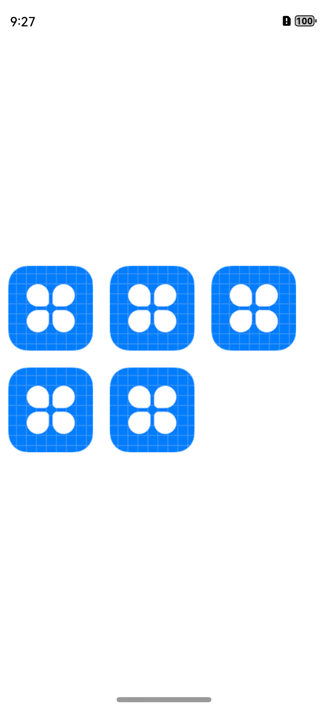
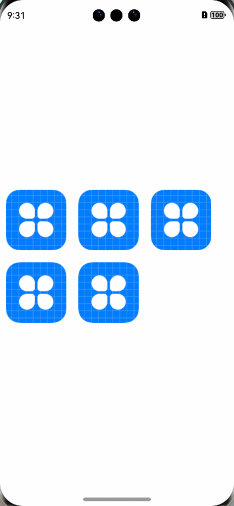

# image-preview

## 简介

image-preview 提供图片预览组件，支持旋转，缩放和平移，提供一些自定义属性

## 下载安装

`ohpm install @rv/image-preview`

## 权限

无需权限

## 属性列表

| 属性名         | 类型                                              | 必须  | 默认值  | 描述                                                                                                                                                        |
|-------------|-------------------------------------------------|-----|------|-----------------------------------------------------------------------------------------------------------------------------------------------------------|
| `option`    | `ImagePreViewOption`                            | 是   | null | 配置选项，集体如下介绍                                                                                                                                               |
| `indicator` | `DotIndicator` or `DigitIndicator` or `boolean` | 否   | true | [见官方文档](https://developer.huawei.com/consumer/cn/doc/harmonyos-references/ts-container-swiper-0000001862607461#ZH-CN_TOPIC_0000001862607461__indicator10) |

## ImagePreViewOption

### 构造函数

```ts
constructor(images: ImageType[])
其中:
type ImageType = PixelMap | ResourceStr | DrawableDescriptor
```

### 接口说明

1. 设置背景色
   ```typescript
   setBackgroundColor(bgColor: ResourceColor)
   ```

2. 设置展示页

   ```typescript
   setShowIndex(showIndex: number)
   ```

3. 设置缓存数量

   ```ts
   setCachedCount(cachedCount: number)
   ```

4. 设置长按事件

   ```ts
   setLongPressListener(event: () => void)
   ```

5. 允许缩放

   ```ts
   setZoomEnabled(zoomEnabled: boolean)
   ```

6. 是否允许拖拽

   ```ts
   setPanEnabled(panEnabled: boolean)
   ```

7. 最大缩放比

   ```ts
   setMaxScale(maxScale: number)
   ```

8. 最小缩放比

   ```TS
   setMinScale(minScale: number)
   ```
   
## 共享元素转场
需要对你的图片列表加上: `.sharedTransition(JSON.stringify(item) + index)`，其中`item`是`Image组件`的`url`参数,
`index`是当前`Image组件`所在的索引，如：
```typescript
ForEach(this.images, (item: ResourceStr, index: number) => {
Image(item)
  .width(100)
  .height(100)
  .margin(10)
  .sharedTransition(JSON.stringify(item) + index)
})
```

## 使用示例
列表页：
```typescript
import { router } from '@kit.ArkUI'

@Entry
@Component
struct ImagePreViewPageIndex {
   @State images: ResourceStr[] = [
      $r('app.media.app_icon'),
      $r('app.media.app_icon'),
      $r('app.media.app_icon'),
      $r('app.media.app_icon'),
      $r('app.media.app_icon'),
   ]

   build() {
      Row() {
         Column() {
            Flex({ wrap: FlexWrap.Wrap }) {
               ForEach(this.images, (item: ResourceStr, index: number) => {
                  Image(item)
                     .width(100)
                     .height(100)
                     .margin(10)
                     .sharedTransition(JSON.stringify(item) + index)
                     .onClick(() => {
                        router.pushUrl({
                           url: 'pages/ImagePreViewPage',
                           params: this.images
                        })
                     })

               })
            }
         }
         .width('100%')
      }
      .height('100%')
   }
}
```
预览页：
```typescript
import { ImagePreView, ImagePreViewOption } from '@rv/image-preview/Index'
import { promptAction, router } from '@kit.ArkUI'

@Entry
@Component
struct ImagePreViewPage {
  images: ResourceStr[] = router.getParams() as ResourceStr[]

  @State imagePreViewOption: ImagePreViewOption | null = null

  aboutToAppear(): void {
    this.imagePreViewOption = new ImagePreViewOption(this.images)
    this.imagePreViewOption.setLongPressListener(() => {
      promptAction.showToast({ message: "1111" })
    })
    this.imagePreViewOption.setRotateEnable(false)
    this.imagePreViewOption.setMinScale(0.1)
    this.imagePreViewOption.setShowIndex(1)
    this.imagePreViewOption.setBackgroundColor(Color.White)
  }
  build() {
    Column() {
      ImagePreView({ option: this.imagePreViewOption as ImagePreViewOption })
    }.width("100%")
    .height("100%")
  }
}
```

效果如下：


