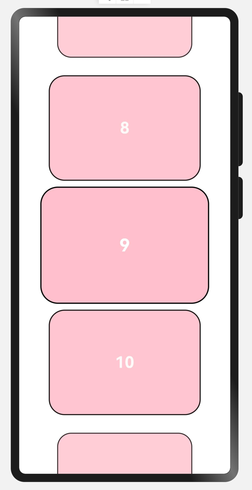

# rvcomponent
## 简介
rvcomponent 是一款基于ArkUI的组件库，可以在Harmony OS 或者 OpenHarmony OS 上使用。
## 权限
无需权限
## 属性列表
| 属性名           | 类型       | 必须  | 默认值       | 描述         |
|:--------------|:---------|:----|:----------|:-----------|
| `datas`       | Array    | 是   | []        | 数据源        |
| `itemView`    | function | 是   | undefined | 子组件        |
| `opacityVal`  | Number   | 否   | 10        | 透明度指数      |
| `offsetVal`   | Number   | 否   | 100       | 每个item的偏移量 |
| `offsetScale` | Number   | 否   | 10        | 缩放偏移量      |
| `isVertical`  | Boolean  | 否   | true      | 是否垂直方向     |
## 使用示例
需要使用@Builder装饰器来用于传递组件
```typescript
@Entry
@Component
struct StackListView {
  @State datas: Array<number>  = [1,2,3,4,5,6,7,8,9,10,11,12,13,14,15];
  build() {
    Column(){
      StackList({
        isVertical: true,
        datas: $datas,
        itemView: (item: DataType,index: number) => {this.itemView(item as number,index)},
        offsetXY: 200
      })
    }
    .width("100%")
      .height("100%")
  }
  @Builder itemView(item: number,index: number){
    ItemView({item: item,index: index})
  }
}

@Component
struct ItemView{
  @State item: number = 0;
  @State index: number = 0;
  build(){
    Row(){
      Text(JSON.stringify(this.item))
        .fontSize(30)
        .fontWeight(FontWeight.Bold)
        .fontColor(Color.White)
    }
    .justifyContent(FlexAlign.Center)
      .width('80%')
      .height(200)
      .borderRadius(30)
      .backgroundColor(Color.Pink)
      .border({
        color: Color.Black,
        width: 2
      })
  }
}
```
效果如下：

